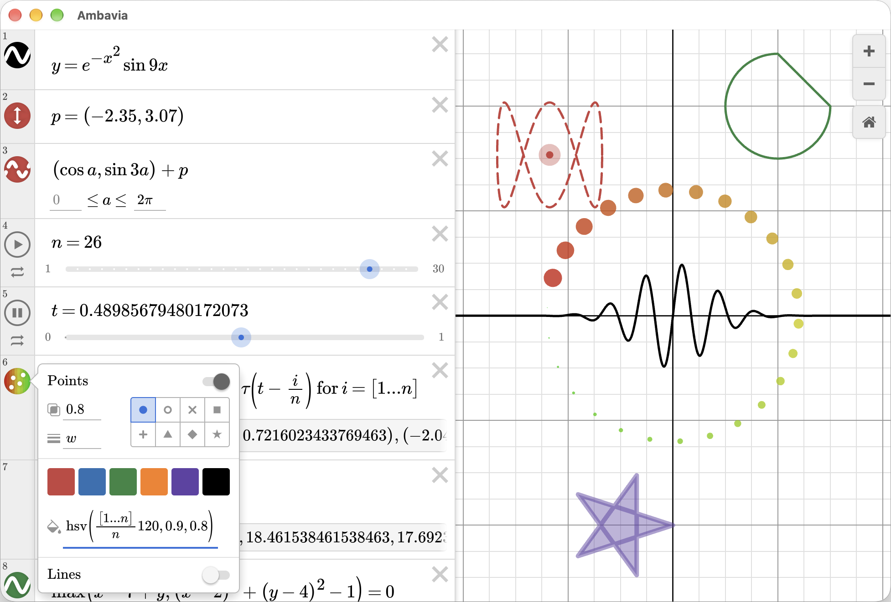

# Ambavia

A recreation of [Desmos Graphing Calculator](https://www.desmos.com/calculator).



Beyond using [`winit`](https://github.com/rust-windowing/winit) for handling window creation and [`wgpu`](https://github.com/gfx-rs/wgpu) for GPU-accelerated rendering, everything else is bespoke and built from scratch. For example, there are no dependencies on any UI frameworks. All the code is home-grown and written by hand without LLMs.

## Running

Ambavia has been tested on macOS, Linux and Windows.

To try it out, first [install Rust](https://rust-lang.org/tools/install/) if you haven't already, then clone the repo and run it with

```sh
cargo run --release
```

## Features

Ambavia's ultimate goal is to implement a superset of Desmos's features, but it's not there yet. At the moment, you can:

- Write expressions with the WYSIWIG LaTeX equation editor
- Define custom variables/functions
- Plot explicit and implicit equations, parametric curves, points and polygons
- Change the style of those plots (line width, color, etc.) by shift left clicking on the icon in the gutter
- Create sliders and configure their animation properties
- See any expression errors printed in the terminal

### Currently unsupported features

- Recursive functions
- Actions and ticker
- Inequalities
- Lists of function plots
- `random()` and other RNG functions
- Optimizing compiler and incremental evaluation
- ...lots more

## Credits

- Fonts are from [`KaTeX`](https://github.com/KaTeX/KaTeX)
- Font atlas generated with [`msdf-atlas-gen`](https://github.com/Chlumsky/msdf-atlas-gen)
